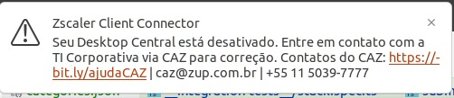

Work with a Serverless Stack, contract first, and with Lambdas in **TypeScript**.

Eliminate the complexity to generate the infrastructure you need to expose an API. Now you can focus on coding Lambdas that execute the business rules.

From an OpenAPI Contract, you have the necessary infrastructure below:

- API Gateway;
- Lambdas (each endpoint generates one different Lambda);
- Cloudwatch Logs;
- X-Ray Tracing;
- Métricas

It also generates Lambda source codes with the structure below:
- Core Components;  
- Controllers;  
- Use Cases;  
- Error Handling;  
- API Schema Types

